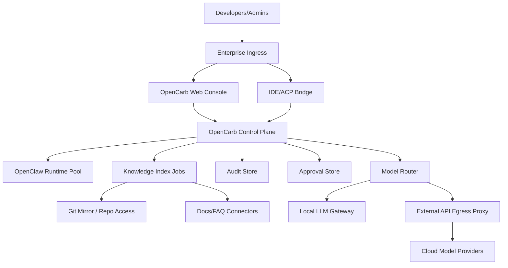

# OpenCarb 部署与安全边界设计

## 1. 目标

`OpenCarb` 的部署方案需要同时满足三件事：

- 默认内网模型优先，降低敏感数据外发风险。
- 在内网模型能力不足时，支持受控的外部模型备援。
- 所有模型、技能、工具和知识访问都具备审计与策略控制。

## 2. 部署原则

- 私有化优先于公有 SaaS。
- 控制面与执行面可以同域部署，但边界必须清晰。
- 模型密钥和出口统一收敛到平台代理层。
- 外部模型访问必须是显式配置，而不是默认开启。
- 审计和审批能力必须独立于 runtime 存在。
- 身份、角色和审批资格必须由统一身份服务裁决。

## 3. 推荐部署拓扑

## 4. 部署层级建议

### 4.1 内网核心层

必须部署在企业内网或专有环境：

- `OpenCarb Control Plane`
- `OpenClaw Runtime Pool`
- `Knowledge Index Jobs`
- `Audit Store`
- `Approval Store`
- `Private Skill Registry`

### 4.2 模型访问层

- `Local LLM Gateway` 部署在内网。
- `Model Router` 部署在控制面同域，作为唯一模型出口。
- `External API Egress Proxy` 独立部署，便于统一审计与域名限制。

### 4.3 接入层

- Web 控制台。
- IDE/ACP bridge。
- PR review webhook 接入。

### 4.4 身份与授权层

- 接入企业 IdP 或内部账号体系。
- 为 Web、IDE/ACP 和 webhook 入口生成统一身份上下文。
- 把平台级角色和工作区级角色分开管理。

## 5. 三种环境模式

### 5.1 模式 A：全内网模式

适用：

- 金融、政企、医疗等高合规环境。

特点：

- 仅允许内网模型。
- 外部 API 完全禁用。
- 适合 V1 试点中高敏感场景。

### 5.2 模式 B：内网优先 + 外部备援

适用：

- 大多数企业试点环境。

特点：

- 默认走内网模型。
- 复杂任务在策略允许时可切到外部模型。
- 外部访问必须经过审批、脱敏和出口代理。

### 5.3 模式 C：托管混合模式

适用：

- 对交付速度要求更高、对完全私有化要求较低的团队。

特点：

- 控制面可托管，知识、技能和审计仍建议在客户专有环境。
- 不建议进入 V1，只适合后续商业化拓展阶段单独论证。

## 6. 模型访问安全边界

### 6.1 统一模型路由

所有模型请求必须走 `Model Router`，禁止 runtime 直接访问模型 API。

`Model Router` 职责：

- 路由到内网或外部模型。
- 应用脱敏规则。
- 注入租户、工作区和审批上下文。
- 记录请求去向、响应结果和失败原因。

### 6.2 外部模型准入条件

满足以下条件才允许外发：

- 工作区策略允许外发。
- 当前请求未命中受限数据规则。
- 目标模型在允许列表中。
- 必要时已通过人工审批。

### 6.3 外发最小化

- 仅发送任务所需的最小上下文。
- 对密钥、凭证、客户标识、内部地址等做脱敏。
- 对完整源码大段外发设置更严格门槛。

## 7. 知识与代码安全边界

### 7.1 知识接入

- 仓库索引使用只读拉取或镜像方式。
- 文档连接器使用最小权限访问。
- 工作区只可索引其绑定的资源。

### 7.2 查询返回

- 检索结果需经过权限过滤。
- 不允许跨工作区返回知识片段。
- 引用内容应尽量附带来源，但要遵守权限边界。
- 检索权限和结果裁剪由 `OpenCarb Knowledge Service` 执行，runtime 不直接连接原始知识源。

## 8. 技能安全边界

### 8.1 技能来源分级

- 官方内置技能。
- 团队私有技能。
- 第三方导入技能。

### 8.2 风险控制

- 默认仅启用官方和审核通过的团队私有技能。
- 第三方导入技能默认禁用，需扫描与审批。
- 高风险技能需要声明所需权限，如文件系统、网络、shell、浏览器。

### 8.3 技能发布流程

1. 上传技能包。
2. 静态扫描与元数据校验。
3. 平台管理员或安全管理员审批。
4. 在工作区灰度启用。
5. 记录启用和执行审计。

## 9. 工具与执行边界

### 9.1 执行原则

- 默认最小权限。
- 不给 runtime 开全量系统能力。
- 工具能力按工作区策略和技能声明组合决定。

### 9.2 示例限制

- 文件系统：仅访问绑定目录。
- 网络：仅访问允许域名。
- Shell：禁用高风险命令或要求审批。
- 浏览器：限制内部系统和指定域名。

## 10. 审计与审批边界

### 10.1 审计最小闭环

以下事件必须可查询：

- 用户发起请求。
- 策略判定结果。
- 模型路由选择。
- 技能执行记录。
- 工具调用与资源访问。
- 外发与审批事件。

### 10.2 审批触发场景

- 高敏感内容需要外发到公有模型。
- 高风险技能首次启用。
- V1 对写入型受保护系统默认直接禁止，不通过审批放行；该类审批留到后续阶段再引入。

### 10.3 审批执行模型

- 同步请求命中审批时，平台返回挂起状态和审批单号。
- 审批单进入后台作业系统，由审批人通过 Web 管理台处理。
- 审批通过后恢复原作业，审批拒绝则终止并写入审计。
- V1 不做通用人工节点编排，只实现上述最小闭环。

## 11. 环境与密钥管理

### 11.1 密钥原则

- 外部模型 API key 仅保存在平台密钥管理系统。
- runtime 不直接持有长期外部凭据。
- 工作区级凭据与平台级凭据分开管理。

### 11.2 配置原则

- 模型、技能、知识源和审批策略配置版本化。
- 所有配置变更写入审计。

## 12. 灾备与运维建议

- 审计存储单独备份。
- 模型代理与控制面支持健康检查。
- 索引任务与异步任务应支持断点恢复。
- 关键配置支持导出和环境迁移。

## 13. V1 推荐落地方式

对首个试点，推荐采用“模式 B：内网优先 + 外部备援”：

- 默认所有代码问答和文档问答走内网模型。
- 对复杂分析类请求开放审批后外部模型回退。
- 所有外发统一经过 `Model Router + Egress Proxy + Audit Store`。
- 不开放第三方技能自由安装。

## 14. 结论

`OpenCarb` 的安全重点不是把所有能力都关掉，而是把模型出口、技能可见性、工具权限和知识边界全部纳入统一控制面。只要部署上坚持“统一代理、默认内网、显式外发、完整审计”四个原则，就能在保证可用性的同时建立企业愿意接受的安全底座。
