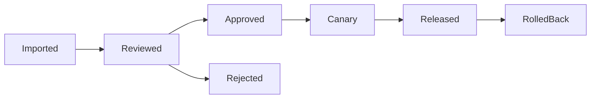

# OpenCarb Phase 2 Skill Governance Spec

## 1. 目标

把 `Phase 1` 的技能启停与锁版，升级为完整的技能治理体系：来源分类、审核、灰度、发布、回滚、审计。

## 2. 治理范围

- 官方技能
- 团队私有技能
- 第三方导入技能

## 3. 关键原则

- runtime 只能看到 `Approved Skill View`
- 技能“已安装”不等于“可执行”
- 高风险技能必须经过审批
- 工作区按版本消费技能

## 4. 生命周期

## 5. 核心对象

| 对象 | 关键字段 |
| --- | --- |
| `SkillPackage` | `skillId`, `sourceType`, `version`, `riskLevel` |
| `SkillReviewRecord` | `reviewer`, `decision`, `comment` |
| `SkillReleasePlan` | `workspaceScope`, `rolloutPercent`, `startAt` |
| `ApprovedSkillView` | `workspaceId`, `skillId`, `version`, `status` |

## 6. 管理动作

- 导入
- 审核
- 启用
- 灰度
- 回滚
- 锁定版本

## 7. 审计要求

- 导入来源可追溯
- 审核与启用人可追溯
- 发布批次与回滚动作可追溯

## 8. Phase 2 验收

- 第三方技能不能直接执行
- 工作区能看到批准后的技能版本
- 技能回滚不影响未关联工作区
