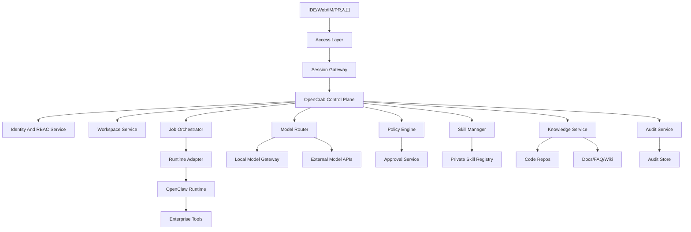

# OpenCrab 系统架构说明

## 1. 设计目标

`OpenCrab` 的架构目标不是替代 `OpenClaw` 的 agent 执行能力，而是在其之上增加企业所需的控制面。系统需要同时满足以下要求：

- 适配部门级或工作组级团队部署。
- 默认支持内网模型优先和受控外部模型回退。
- 兼容 `OpenClaw` runtime、ACP 与 skills 生态。
- 对模型、技能、工具和知识访问进行统一治理。
- 为后续扩展更多技能、更多知识源和更多接入入口保留边界。

## 2. 总体分层

## 3. 关键设计决策

### 3.1 把控制面和执行面分离

- `OpenClaw Runtime` 负责 agent 执行、技能调用和会话运行。
- `OpenCrab Control Plane` 负责工作区、策略、模型、技能和审计治理。
- 这样可以减少对上游开源 runtime 的深度侵入，降低升级成本。

### 3.2 以工作区为隔离边界

- 所有资源围绕 `workspace` 组织。
- 每个工作区拥有自己的成员、知识源、模型策略、技能集和审计视图。
- 默认不跨工作区共享配置和数据。

### 3.3 以策略引擎统一控制风险

- 模型外发、工具执行、技能启用和高敏感请求统一经过策略判定。
- 审批流是策略系统的一部分，而不是散落在各模块里的例外逻辑。

### 3.4 身份、权限和知识都由平台裁决

- 统一身份、角色和审批资格由 `OpenCrab` 控制面定义。
- 知识检索与技能可见性都以平台计算出的“最终执行面”为准。
- `OpenClaw Runtime` 不负责最终权限判断，只消费控制面下发的结果。

## 4. Access Layer

`Access Layer` 对外暴露多个入口，但所有入口最终都必须归一到统一的会话和策略判断链路。

### 4.1 入口类型

- V1：IDE 插件。
- V1：Web 管理台。
- V1：PR review webhook/bot。
- 后续阶段：企业 IM 机器人和成员侧 Web 对话入口。

### 4.2 职责

- 建立统一身份与会话上下文。
- 将用户、工作区、仓库、当前文件和环境信息传递给下游。
- 负责入口级限流、认证和基础可观测性。

## 5. Session Gateway

`Session Gateway` 是接入层和控制面的边界，负责把外部请求映射为平台内部标准会话。

### 5.1 会话上下文

- `userId`
- `workspaceId`
- `channelType`
- `resourceContext`
- `policyContext`

### 5.2 核心职责

- 为每个请求附加工作区策略。
- 将入口会话映射到 `OpenClaw` 可识别的 runtime session。
- 把所有模型、技能、工具调用纳入统一事件流。

## 6. Control Plane

`Control Plane` 是 `OpenCrab` 的核心差异化能力，由多个治理子系统组成。

### 6.0 Identity And RBAC Service

负责：

- 对接企业 IdP 或内部账号体系。
- 定义 `PlatformAdmin`、`SecurityAdmin`、`WorkspaceAdmin`、`WorkspaceMember` 等最小角色。
- 为 ACP、Web 和 webhook 入口签发统一身份上下文。
- 判定审批人资格和工作区角色边界。

### 6.1 Workspace Service

负责：

- 工作区创建与归档。
- 工作区成员和角色管理。
- 仓库、文档源、模型策略和技能集绑定。

关键对象：

- `Workspace`
- `WorkspaceMember`
- `WorkspaceResourceBinding`
- `WorkspacePolicyBundle`

### 6.2 Model Router

负责：

- 维护 provider、deployment、policy 三层抽象。
- 根据请求特征决定使用内网模型还是外部模型。
- 处理超时、失败和回退。

建议抽象：

- `Provider`: 模型厂商或接入方式。
- `Deployment`: 某个可实际调用的模型实例。
- `RoutingPolicy`: 任务到模型部署的决策规则。

### 6.3 Policy Engine

负责：

- 内容分类：公开、内部、敏感、受限。
- 模型出口策略。
- 工具白名单和禁用规则。
- 技能启用前审批。
- 高风险任务转审批流。

策略触发点：

- 进入模型前。
- 进入工具调用前。
- 技能安装或启用前。
- 文件访问和知识查询前。

审批执行语义：

- 同步会话中不等待人工审批完成。
- 命中审批后创建 `PendingApprovalJob` 并返回挂起状态。
- 审批通过后由 `Job Orchestrator` 恢复执行，审批拒绝则关闭作业并记录原因。

### 6.4 Audit Service

负责：

- 记录 request、decision、execution、result 四类事件。
- 提供查询、导出和追责能力。
- 对接外部日志或 SIEM 系统。

最小事件字段：

- `eventId`
- `timestamp`
- `workspaceId`
- `userId`
- `eventType`
- `policyDecision`
- `modelDeployment`
- `skillName`
- `toolName`
- `resourceRef`

### 6.5 Skill Manager

负责：

- 工作区可用技能列表管理。
- 技能来源区分：官方、团队私有、第三方。
- 技能启用审批、版本锁定和灰度发布。
- 生成工作区级 `Approved Skill View`，作为 runtime 唯一可见技能清单。

### 6.6 Job Orchestrator

负责：

- 长任务和异步任务调度。
- PR review、索引更新、周期任务执行。
- 失败重试、状态跟踪和通知。
- 审批挂起任务的恢复、终止和超时处理。

适合进入作业系统的任务：

- 大仓库索引。
- 文档增量同步。
- 批量 review。
- 需要审批后继续运行的任务。

## 7. 执行面

### 7.1 Runtime Adapter

`Runtime Adapter` 是控制面和 `OpenClaw Runtime` 的隔离层，用于：

- 把工作区上下文映射到 runtime session。
- 在调用前后插入策略评估与审计事件。
- 控制可见 skill 集合和可用工具能力。

### 7.2 OpenClaw Runtime

继续承担：

- agent 会话执行。
- skill 调用。
- ACP 桥接会话。
- 与底层工具链交互。

## 8. 知识与工具层

### 8.1 Knowledge Service

负责：

- 仓库、文档和 FAQ 的统一索引。
- 权限过滤后的检索结果提供。
- 向 runtime 提供带来源的检索上下文。

边界说明：

- `Knowledge Service` 属于控制面，而不是 runtime 内部模块。
- runtime 只能请求“已过滤后的检索结果”，不能直连原始知识源。
- 是否允许某段检索内容继续外发给外部模型，仍需经过 `Policy Engine` 二次判定。

### 8.2 Enterprise Tools

示例：

- Git 平台工具。
- 文档系统工具。
- 工单系统工具。
- 企业内部 API 工具。

这些工具是否暴露给 runtime，不由工具自身决定，而由工作区策略决定。

## 9. 数据对象建议

最少需要以下数据实体：

- `Workspace`
- `PolicyBundle`
- `ModelProvider`
- `ModelDeployment`
- `SkillPackage`
- `SkillApproval`
- `KnowledgeSource`
- `IndexJob`
- `AuditEvent`
- `AgentSession`

## 10. 可观测性建议

### 10.1 指标

- 请求量、成功率、平均时延。
- 内网模型命中率和外部模型回退率。
- 审批触发率和拦截率。
- 技能启用率和失败率。
- 索引任务成功率。

### 10.2 日志与追踪

- 每个请求有唯一 trace id。
- 审计事件与运行事件可以关联同一 trace。
- 模型与工具调用必须能回溯到上游入口和工作区。

## 11. V1 架构结论

V1 应坚持一个简单原则：`OpenCrab` 负责管控，`OpenClaw` 负责执行。只要控制面边界清晰，后续无论是更换模型、增加技能、扩展入口还是增强审批流，都可以在不推翻 runtime 的前提下渐进演进。
