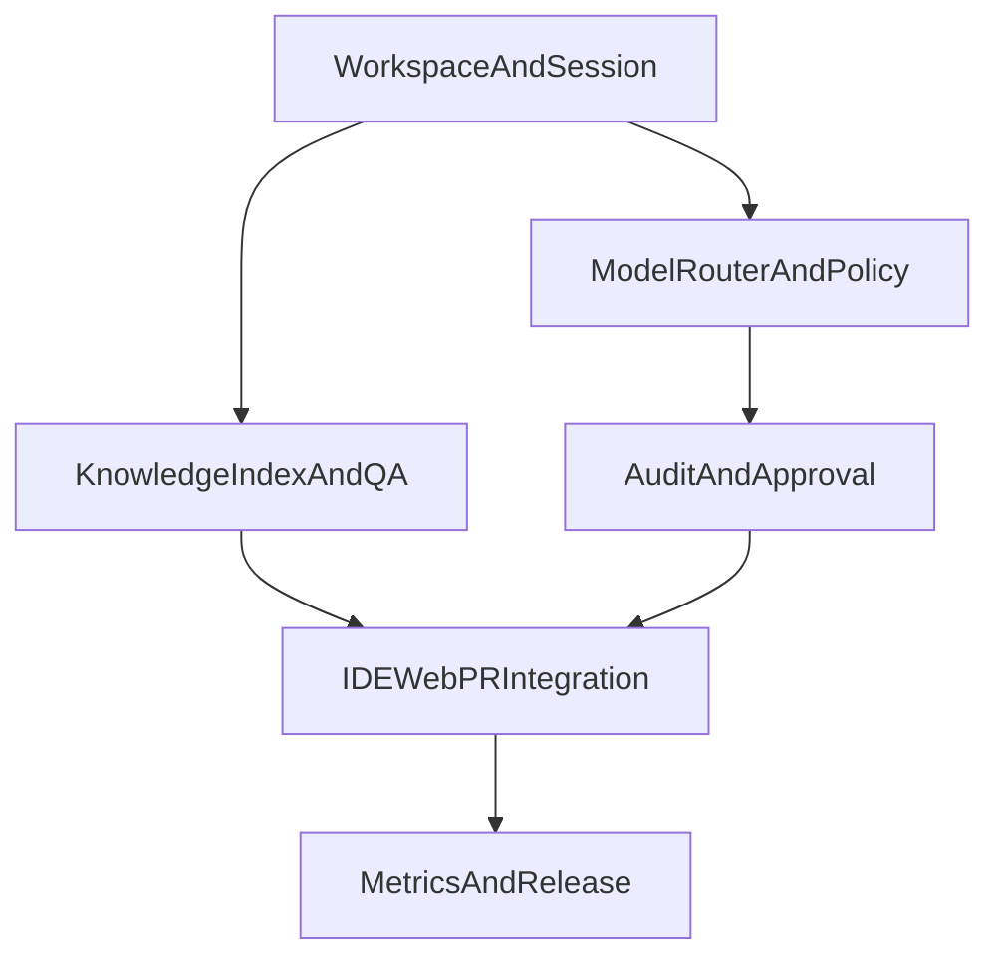

# OpenCrab Phase 1 执行 Backlog

## 1. 文档目的

本文把 `Phase 1` 从“readiness 提醒”细化为可直接排期执行的 backlog。目标是让团队围绕一个试点工作区，完成 `OpenCrab` 的最小技术闭环：工作区、模型路由、知识问答、审计审批、入口联调与基础指标。

## 2. Phase 1 总目标

- 建立一个部门级团队愿意试用的最小闭环。
- 跑通三个试点场景：代码问答、轻量 PR review、新人 onboarding。
- 确保治理能力最小可用：工作区隔离、模型出口控制、最小审批、审计可回溯。

## 3. 交付边界

### 3.1 必须交付

- `Workspace + RBAC`
- `IDE Entry + Web Console + PR Webhook`
- `Model Router`：1 个内网模型网关 + 1 个外部模型回退
- `Knowledge Service`：Git + Docs/FAQ 初始构建与增量更新
- `Audit Service`：模型、工具、技能、文件访问与外发留痕
- 最小审批闭环：高风险技能启用、受限内容外发

### 3.2 明确不做

- 成员侧通用 Web Chat
- 通用审批编排平台
- 多节点执行集群
- Graph DB 全局依赖图谱
- 大规模第三方技能自由安装

## 4. 角色建议

- `PM`：范围、试点、验收、节奏
- `Tech Lead`：依赖编排、方案冻结、排期
- `Backend`：Workspace、Session、Policy、Audit、Job
- `AI`：Model Router、Knowledge QA、评测
- `Frontend`：Web Console、审计页、审批页
- `Sec`：外发规则、工具白名单、审计检查
- `Platform`：IdP、环境、接入网关、发布

## 5. Sprint 建议

### Sprint 1

- Epic 1 `Workspace + Session Gateway`
- Epic 2 `Model Router + Policy`
- Epic 3 `Knowledge Index + QA Chain` 启动

### Sprint 2

- Epic 3 `Knowledge Index + QA Chain` 完成首轮闭环
- Epic 4 `Audit + Minimal Approval`
- Epic 5 `IDE/Web/PR Integration` 启动

### Sprint 3

- Epic 5 `IDE/Web/PR Integration` 完成联调
- Epic 6 `Metrics + Release Readiness`
- 试点演示、UAT、上线准备

## 6. Jira / Linear 快速导入视图

### 6.1 Epic 表

| 建议编号 | 层级 | 标题 | 主要 Owner | 建议 Sprint | 依赖 | 完成判定 |
| --- | --- | --- | --- | --- | --- | --- |
| P1-E1 | Epic | Workspace + Session Gateway | Backend / Platform | Sprint 1 | 无 | 工作区、角色、统一 session context 可用 |
| P1-E2 | Epic | Model Router + Policy | AI / Backend / Sec | Sprint 1 | P1-E1 | 内网优先路由、外部回退、出口策略可用 |
| P1-E3 | Epic | Knowledge Index + QA Chain | AI / Backend | Sprint 1-2 | P1-E1, P1-E2 | Git / Docs 索引、带来源问答可用 |
| P1-E4 | Epic | Audit + Minimal Approval | Backend / Sec / Frontend | Sprint 2 | P1-E1, P1-E2, P1-E3 | 审计链路、两类最小审批闭环可用 |
| P1-E5 | Epic | IDE / Web / PR Integration | Frontend / Backend | Sprint 2-3 | P1-E1, P1-E2, P1-E3, P1-E4 | 三个入口联调完成，至少 1 个真实仓库跑通 |
| P1-E6 | Epic | Metrics + Release Readiness | PM / Data / Platform | Sprint 3 | P1-E4, P1-E5 | 指标口径、上线 checklist、UAT 结论齐备 |

### 6.2 Story 表

| 建议编号 | 所属 Epic | Story 标题 | 主要 Owner | 依赖 | 建议优先级 | 完成判定 |
| --- | --- | --- | --- | --- | --- | --- |
| P1-S1 | P1-E1 | 工作区基础域模型 | Backend | 无 | P0 | 工作区、成员、资源绑定接口可用 |
| P1-S2 | P1-E1 | 角色与 IdP 映射 | Platform | P1-S1 | P0 | 最小角色集可映射到真实身份组 |
| P1-S3 | P1-E1 | Session Gateway 与上下文组装 | Backend | P1-S1, P1-S2 | P0 | 统一 session context 可提供给 runtime |
| P1-S4 | P1-E2 | 模型提供方与部署抽象 | AI / Backend | P1-S3 | P0 | Provider / Deployment / Policy 三层抽象可用 |
| P1-S5 | P1-E2 | 路由策略与回退逻辑 | AI | P1-S4 | P0 | 内网优先、超时/失败回退可用 |
| P1-S6 | P1-E2 | 出口策略与外发规则 | Sec / Backend | P1-S5 | P0 | 模型出口、工具白名单、外发规则生效 |
| P1-S7 | P1-E3 | 知识源绑定与初始索引 | Backend | P1-S3 | P0 | Git / Docs 初始索引成功 |
| P1-S8 | P1-E3 | 增量更新与权限过滤 | Backend | P1-S7, P1-S5 | P0 | 增量更新与平台权限过滤可用 |
| P1-S9 | P1-E3 | QA 链路与来源引用 | AI | P1-S8, P1-S5 | P0 | 代码问答与 onboarding 问答带来源返回 |
| P1-S10 | P1-E4 | 审计事件模型与写入链路 | Backend | P1-S3, P1-S5, P1-S8 | P0 | 模型、工具、技能、外发事件完整写入 |
| P1-S11 | P1-E4 | 最小审批状态机 | Backend / Sec | P1-S10, P1-S6 | P0 | `pending -> approved/rejected -> resume/terminate` 可用 |
| P1-S12 | P1-E4 | 审计查询页与审批页 | Frontend | P1-S10, P1-S11 | P1 | 审计查询与审批操作页面可用 |
| P1-S13 | P1-E5 | IDE 问答接入 | Backend | P1-S9, P1-S10 | P0 | IDE 能完成带来源问答 |
| P1-S14 | P1-E5 | Web 管理台最小闭环 | Frontend / Backend | P1-S3, P1-S6, P1-S12 | P0 | 工作区、模型、技能、审计、审批页面可用 |
| P1-S15 | P1-E5 | PR Review webhook/bot | Backend / AI | P1-S9, P1-S11 | P1 | 至少 1 个真实仓库跑通轻量 review |
| P1-S16 | P1-E6 | 指标口径与埋点 | PM / Data | P1-S10, P1-S15 | P1 | WAU、命中率、审计完整率、时延口径冻结 |
| P1-S17 | P1-E6 | 上线准备与回滚 | Platform | P1-S13, P1-S14, P1-S15 | P1 | pilot 环境、回滚条件、值守安排完成 |
| P1-S18 | P1-E6 | UAT 与 Phase 1 关闭评审 | PM / Tech Lead | P1-S16, P1-S17 | P1 | UAT、复盘、下一阶段结论输出 |

### 6.3 Jira / Linear 字段建议

| 字段 | 建议值 |
| --- | --- |
| `Project` | `OpenCrab` |
| `Cycle / Sprint` | `Sprint 1` / `Sprint 2` / `Sprint 3` |
| `Label` | `phase1`, `workspace`, `model-router`, `knowledge`, `audit`, `approval`, `integration`, `release` |
| `Priority` | `P0` 表示阻塞主链路，`P1` 表示同 Sprint 内重要但可后置 |
| `Status` | `Todo`, `Ready`, `In Progress`, `Blocked`, `Review`, `Done` |
| `Parent` | Story 挂到 Epic 下，Checklist 作为 Story 子任务 |
| `Milestone` | `Phase 1 MVP` |

### 6.4 子任务模板

每个 Story 建议统一拆成 4 类子任务，便于 Jira / Linear 批量维护：

1. `Design`：接口、数据结构、状态机或页面草图
2. `Build`：核心实现
3. `Test`：联调、验收、异常场景验证
4. `Docs/Ops`：使用说明、埋点、发布/回滚材料

## 7. Epic 依赖关系

## 8. Epic 1：Workspace + Session Gateway

### 目标

建立工作区隔离、角色映射和统一会话上下文，为后续模型、知识、技能和审计链路提供统一输入。

### 验收映射

- 工作区可以独立创建、配置和成员接入。
- 默认不跨工作区共享知识、技能和策略。
- IDE / Web / PR 入口都能生成统一的 session context。

### Story 1.1 工作区基础域模型

- 输入：工作区名称、成员列表、仓库绑定、文档源绑定、模型策略绑定
- 输出：`Workspace`、`WorkspaceMember`、`WorkspaceResourceBinding`、`WorkspacePolicyBundle`
- DoD：
  - 支持创建/编辑/归档工作区
  - 支持成员与角色绑定
  - 支持仓库、文档源、模型策略关联
- 依赖：无
- 风险与回滚：若权限模型尚未冻结，先保留最小角色集，不开放复杂角色继承
- Checklist：
  - 定义数据实体与字段
  - 设计创建/更新接口
  - 定义工作区隔离规则
  - 准备样例工作区数据

### Story 1.2 角色与 IdP 映射

- 输入：企业 IdP 组、最小角色集
- 输出：`PlatformAdmin`、`SecurityAdmin`、`WorkspaceAdmin`、`WorkspaceMember` 映射表
- DoD：
  - Web / IDE / webhook 可解析统一身份
  - 审批资格可根据角色判定
- 依赖：Story 1.1
- 风险与回滚：若 IdP 集成未就绪，先提供本地映射配置文件
- Checklist：
  - 冻结最小角色说明
  - 设计 IdP group 映射表
  - 明确审批资格逻辑
  - 补充异常角色处理策略

### Story 1.3 Session Gateway 与上下文组装

- 输入：入口请求、用户身份、工作区信息、资源上下文
- 输出：统一 session context
- DoD：
  - context 至少包含 `userId`、`workspaceId`、`channelType`、`resourceContext`、`policyContext`
  - 可映射为 runtime session
- 依赖：Story 1.1、1.2
- 风险与回滚：如果入口差异过大，先统一 IDE 与 Web，PR webhook 第二批接入
- Checklist：
  - 定义 session context schema
  - 设计入口到 session 的转换逻辑
  - 追加 trace id
  - 写出错误码与失败场景

## 9. Epic 2：Model Router + Policy

### 目标

建立以内网模型优先、外部模型受控回退为核心的模型访问层，并把模型出口策略落实到请求决策。

### 验收映射

- 可接入 1 个内网模型网关和 1 个外部模型 API
- 请求可按策略路由
- 外部调用必须可控、可审计、可拦截

### Story 2.1 模型提供方与部署抽象

- 输入：Provider、Deployment、RoutingPolicy 配置
- 输出：统一模型注册表
- DoD：
  - 支持至少两个 deployment
  - 区分 provider、deployment、policy 三层
- 依赖：Epic 1
- 风险与回滚：先只接 1 个内网 + 1 个外部，不做多提供商抽象优化
- Checklist：
  - 定义 Provider/Deployment 结构
  - 设计模型配置存储
  - 定义状态与健康检查字段
  - 准备默认路由策略

### Story 2.2 路由策略与回退逻辑

- 输入：任务类型、敏感级别、成本级别、超时结果
- 输出：模型决策结果
- DoD：
  - 支持内网优先
  - 支持受控外部回退
  - 支持超时/失败切换
- 依赖：Story 2.1
- 风险与回滚：回退策略过早复杂化，先支持单层 fallback
- Checklist：
  - 定义路由输入字段
  - 设计 fallback 顺序
  - 增加失败日志
  - 补充成本/时延埋点

### Story 2.3 出口策略与外发规则

- 输入：内容分级、模型出口白名单、工具白名单
- 输出：允许、拦截、转审批决策
- DoD：
  - 敏感内容可被拦截或挂起审批
  - 工具/模型调用走统一策略判定
- 依赖：Story 2.2
- 风险与回滚：先只支持受限内容外发审批，不开放高风险工具审批
- Checklist：
  - 定义内容分级
  - 定义模型出口规则
  - 定义工具白名单结构
  - 补充审计字段

## 10. Epic 3：Knowledge Index + QA Chain

### 目标

让团队成员能够对代码仓和内部文档提问，并获得带来源的回答。

### 验收映射

- Git + Docs/FAQ 可完成初始索引与增量更新
- 问答结果带来源引用
- runtime 不能绕过平台权限过滤

### Story 3.1 知识源绑定与初始索引

- 输入：Git 仓库、Docs/FAQ 源
- 输出：可用索引任务与索引状态
- DoD：
  - 支持至少 2 个代码仓和 1 个文档源
  - 能查看索引状态
- 依赖：Epic 1
- 风险与回滚：先只支持代码仓 + 1 类文档源
- Checklist：
  - 定义 KnowledgeSource
  - 设计初始索引任务
  - 输出索引状态字段
  - 增加失败重试策略

### Story 3.2 增量更新与权限过滤

- 输入：代码变更、文档变更、工作区权限
- 输出：增量更新后的可检索片段
- DoD：
  - 支持增量更新
  - 权限过滤在平台执行
  - runtime 获取的是过滤后结果
- 依赖：Story 3.1、Epic 2
- 风险与回滚：若权限继承复杂，V1 先按工作区粒度做最小继承
- Checklist：
  - 定义增量触发机制
  - 定义权限继承规则
  - 设计过滤前后数据接口
  - 增加过滤失败告警

### Story 3.3 QA 链路与来源引用

- 输入：IDE 问题、工作区上下文、检索结果
- 输出：回答 + 来源引用
- DoD：
  - 代码问答可用
  - onboarding 问答可用
  - 回答附带来源引用
- 依赖：Story 3.2、Epic 2
- 风险与回滚：如果回答质量不稳定，优先保证来源准确与引用可见
- Checklist：
  - 设计 retrieval -> model 输入协议
  - 定义来源引用渲染格式
  - 输出失败回退说明
  - 收集问答满意度样本

## 11. Epic 4：Audit + Minimal Approval

### 目标

建立最小治理闭环，使关键行为可追溯、关键风险可审批。

### 验收映射

- 审计覆盖模型、工具、技能、文件访问、外发
- 两类审批可挂起与恢复
- 审计页面可按用户、时间、工作区查询

### Story 4.1 审计事件模型与写入链路

- 输入：request、decision、execution、result 事件
- 输出：统一 AuditEvent
- DoD：
  - 每个关键链路带 trace id
  - 至少记录模型、工具、技能、文件访问、外发事件
- 依赖：Epic 1、2、3
- 风险与回滚：先记录最关键字段，后续再补充扩展属性
- Checklist：
  - 定义事件类型
  - 定义最小字段集
  - 接入写入接口
  - 增加查询索引

### Story 4.2 最小审批状态机

- 输入：高风险技能启用、受限内容外发
- 输出：`pending approval`、审批单号、恢复或终止结果
- DoD：
  - 命中规则后任务进入挂起
  - 审批后任务可恢复或终止
  - 审批结果可追溯
- 依赖：Story 4.1、Epic 2
- 风险与回滚：V1 不做通用审批流编排，只覆盖两类审批
- Checklist：
  - 定义审批状态机
  - 定义审批单结构
  - 设计 resume/terminate 语义
  - 补充超时规则

### Story 4.3 审计查询页与审批页

- 输入：筛选条件、审批单号
- 输出：Web 查询结果、审批操作结果
- DoD：
  - 支持按用户、时间、工作区、模型、技能查询
  - 可查看审批状态与结果
- 依赖：Story 4.1、4.2
- 风险与回滚：前端页先做最小查询，不做复杂报表
- Checklist：
  - 定义查询接口
  - 定义审批操作接口
  - 补充空状态与错误状态
  - 编写最小使用说明

## 12. Epic 5：IDE / Web / PR Integration

### 目标

让三个入口分别跑通问答、管理和轻量 PR review。

### 验收映射

- IDE 可发起团队问答
- Web 管理台可配置与审计
- 至少一个真实仓库能跑通轻量 PR review

### Story 5.1 IDE 问答接入

- 输入：代码上下文、用户问题、工作区 session
- 输出：带来源的回答
- DoD：
  - 支持团队问答与代码上下文请求
  - 能展示引用来源
- 依赖：Epic 1、2、3、4
- 风险与回滚：先只支持问答，不做复杂重构操作
- Checklist：
  - 定义 IDE 请求接口
  - 设计来源展示格式
  - 验证失败提示
  - 跑通 demo 场景

### Story 5.2 Web 管理台最小闭环

- 输入：工作区配置、模型配置、技能配置、审批处理、审计查询
- 输出：管理台可操作页面
- DoD：
  - 工作区配置页可用
  - 模型接入页可用
  - 技能治理页可用
  - 审计页与审批页可用
- 依赖：Epic 1、2、4
- 风险与回滚：先保证管理功能可用，不做高级可视化
- Checklist：
  - 列出页面清单
  - 对齐接口字段
  - 补充审批交互
  - 验证角色权限显示

### Story 5.3 PR Review webhook/bot

- 输入：PR 变更、工作区策略、review 技能模板
- 输出：review 结果写回代码托管平台或管理台
- DoD：
  - 至少 1 个真实仓库可跑通轻量闭环
  - 结果进入审计
- 依赖：Epic 2、3、4
- 风险与回滚：V1 只做 webhook/bot，不做完整 review 平台
- Checklist：
  - 定义 webhook 输入
  - 定义 review 输出格式
  - 设计回写方式
  - 准备真实仓库联调样本

## 13. Epic 6：Metrics + Release Readiness

### 目标

建立 Phase 1 的最小指标面板、发布准备和试点评审材料。

### 验收映射

- 能跟踪 WAU、知识命中率、内网模型命中率、审计完整率、问答时延
- 有一套试点上线 checklist
- 有基础回滚与问题响应方案

### Story 6.1 指标口径与埋点

- 输入：业务指标、平台指标、埋点事件
- 输出：统一指标口径文档与埋点字段
- DoD：
  - 明确 WAU、命中率、完整率、时延定义
  - 与审计/运行事件可关联
- 依赖：Epic 4、5
- 风险与回滚：先做最小指标，不做复杂 BI 报表
- Checklist：
  - 冻结指标定义
  - 设计埋点字段
  - 定义采集周期
  - 补充样例报表

### Story 6.2 上线准备与回滚

- 输入：环境、配置、发布步骤、回滚条件
- 输出：试点上线 checklist
- DoD：
  - 有 dev/staging/pilot 环境清单
  - 有回滚触发条件
  - 有负责人值守安排
- 依赖：Epic 1-5
- 风险与回滚：配置变更多时优先脚本化，避免手工上线
- Checklist：
  - 列出环境依赖
  - 列出上线步骤
  - 列出回滚条件
  - 明确值守联系人

### Story 6.3 UAT 与 Phase 1 关闭评审

- 输入：试点反馈、验收结果、指标数据
- 输出：Phase 1 验收结论
- DoD：
  - 三个核心场景都有可演示结果
  - 至少完成一次试点复盘
  - 可决定进入 Phase 2 或收缩范围
- 依赖：Epic 1-5、Story 6.1、6.2
- 风险与回滚：如内网模型质量不达标，优先收缩范围而非扩大功能
- Checklist：
  - 准备 UAT 脚本
  - 汇总验收数据
  - 组织试点复盘
  - 输出下一阶段建议

## 14. Phase 1 完成标准

- 代码问答和 onboarding 问答稳定可用，并附带来源。
- 至少一个真实仓库跑通轻量 PR review。
- 管理员可查看审计记录、审批结果并控制技能可见性与模型出口。
- 高风险技能启用与受限内容外发可进入挂起审批并在审批后恢复。
- 指标达到首轮目标：
  - 试点团队周活跃率不低于 60%
  - 知识问答满意度建议不低于 70%
  - 内网模型命中比例不低于 80%
  - 审计事件完整率不低于 95%
