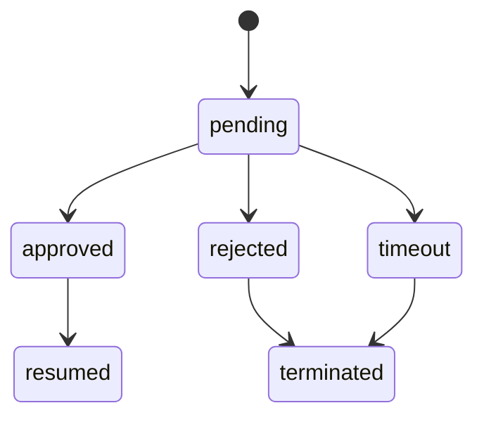

# OpenCrab Phase 2 Approval Design

## 1. 设计目标

`Phase 2` 在 `Phase 1` 两类最小审批基础上，扩展为可配置审批能力，但仍保持与企业现有流程解耦，不把 OpenCrab 做成通用 BPM 平台。

## 2. 设计原则

- 审批依然由 `Policy Engine` 触发
- 挂起、恢复、终止由 `Job Orchestrator` 执行
- 审批只治理 OpenCrab 自身高风险行为
- 所有审批行为必须进入审计

## 3. 审批对象

| 类型 | 示例 |
| --- | --- |
| 模型外发审批 | 受限内容请求外部模型 |
| 工具调用审批 | 高风险企业 API 调用 |
| 技能治理审批 | 第三方技能安装、灰度发布 |
| 批量作业审批 | 大规模 review、批量索引 |

## 4. 状态机

## 5. 核心数据对象

| 对象 | 关键字段 |
| --- | --- |
| `ApprovalTicket` | `ticketId`, `workspaceId`, `approvalType`, `riskLevel`, `status`, `approvers` |
| `ApprovalDecision` | `ticketId`, `decision`, `comment`, `decidedBy`, `decidedAt` |
| `ApprovalPolicy` | `policyId`, `triggerEvent`, `approverRule`, `timeoutMinutes` |

## 6. 配置维度

- 工作区
- 风险等级
- 入口类型
- 技能来源
- 模型出口类型

## 7. 与 Phase 1 的边界

- `Phase 1` 只保留两类最小审批
- `Phase 2` 才引入通用审批规则配置
- `Phase 2` 仍不支持跨系统多级串联审批

## 8. 管理台需求

- 审批规则列表
- 审批单查询
- 超时单视图
- 批量审批能力

## 9. 验收标准

- 新审批类型可配置，无需改 runtime
- 审批超时可自动终止任务
- 审批结果、恢复结果、终止结果均可追溯
