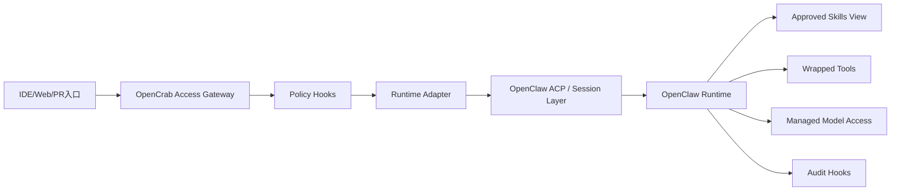

# OpenCrab 与 OpenClaw Runtime 复用方案

## 1. 文档目的

本文说明 `OpenCrab` 如何复用 `OpenClaw` 的现有能力，并定义隔离适配层，避免企业版控制面与上游开源 runtime 发生强耦合。

## 2. 复用原则

- 尽量复用 `OpenClaw` 已成熟的 agent 执行、ACP 接入和 skills 机制。
- 不把工作区、策略、审计和审批等企业控制逻辑直接硬编码到上游 runtime。
- 通过适配层和 sidecar 方式增强，而不是大规模 fork 修改。
- 把所有企业特性放在可替换、可版本化的边界模块中。

## 3. 建议复用的 OpenClaw 能力

### 3.1 Agent Runtime

建议直接复用：

- session 生命周期管理。
- prompt 执行流程。
- skill 调度与运行。
- 底层工具调用机制。

原因：

- 这是 `OpenClaw` 的核心优势，重复建设成本高。
- 企业版更大的价值在于治理，而不是重写同类执行内核。

### 3.2 ACP Bridge

建议直接复用：

- ACP over stdio 的 IDE 接入方式。
- session key 与 gateway session 的映射机制。

企业版需要补充：

- 在 ACP 接入前完成企业身份与工作区绑定。
- 把 ACP session 映射到 `workspace + user + channel` 的内部语义。
- 对 ACP 会话附加角色、审批资格和工作区策略快照。

### 3.3 Skills 机制

建议兼容复用：

- `SKILL.md` 的目录式定义。
- 工作目录、本地目录和 bundled skills 的覆盖优先级思想。
- skill 元数据和启用门槛机制。

企业版需要增强：

- 技能审批。
- 技能签名或可信来源校验。
- 工作区可见性控制。
- 版本冻结和灰度发布。

## 4. 不建议直接复用的部分

以下内容不建议直接塞进 `OpenClaw` runtime 内部，而应由 `OpenCrab` 单独实现：

- 团队工作区与成员管理。
- 企业 RBAC/审批流。
- 模型路由策略和成本治理。
- 安全审计与合规日志。
- 企业私有技能仓与发布流程。
- 工作区级知识源权限控制。

## 5. 适配架构



## 6. Runtime Adapter 设计

`Runtime Adapter` 负责把企业控制面语义翻译成 `OpenClaw` 可执行语义。

### 6.1 输入

- 工作区上下文。
- 用户身份与角色。
- 当前入口来源。
- 允许的 skills 列表。
- 允许的工具白名单。
- 模型路由决策。

### 6.2 输出

- 一个运行时 session。
- 该 session 可见的 skill 集合。
- 该 session 可调用的工具代理。
- 该 session 使用的模型访问通道。

### 6.3 拦截点

适配层至少要支持四类拦截：

1. 请求前拦截：身份、工作区、策略装载。
2. 模型前拦截：内容分类和路由判断。
3. 工具前拦截：权限、审批、参数审查。
4. 结果后拦截：审计记录、脱敏和回传包装。

### 6.4 审批挂起与恢复

- 命中审批规则时，适配层不继续同步执行，而是创建挂起作业。
- 挂起作业记录当前 session、请求上下文、待审批动作和超时时间。
- IDE/ACP 收到的不是最终答案，而是 `pending approval` 状态和审批单号。
- 审批通过后，由后台作业重新进入 runtime 执行；审批拒绝则结束会话分支并返回拒绝原因。

## 7. ACP 复用方案

### 7.1 推荐做法

- 保留 `OpenClaw ACP` 作为 IDE 协议桥。
- 在 `OpenCrab` 接入层上封装 ACP 启动和 session 映射。
- 不让 IDE 直接绕过控制面访问原始 runtime。

### 7.2 Session 映射建议

内部 session key 可采用如下结构：

```text
workspace:{workspaceId}:user:{userId}:channel:{channelType}:session:{sessionId}
```

这样做的价值：

- 易于审计与回放。
- 易于按工作区切割上下文和权限。
- 不需要侵入 `OpenClaw` 的原始会话语义。

## 8. Skills 复用与增强

### 8.1 兼容层要求

- `OpenCrab` 不改变 `SKILL.md` 基础格式。
- 工作区仍然可以覆盖同名技能，但覆盖行为需经过平台治理。
- 技能来源记录为元数据的一部分。

### 8.2 企业增强字段建议

建议在企业技能目录中引入平台侧元数据：

- `sourceType`
- `ownerWorkspaceId`
- `trustLevel`
- `approvalStatus`
- `approvedBy`
- `releaseChannel`
- `lockedVersion`

这些字段由平台存储，不强依赖写回原始 `SKILL.md`。

### 8.3 技能暴露机制

- runtime 不直接读取所有已安装技能。
- `OpenCrab` 先根据工作区策略计算“批准后的可见技能视图”。
- runtime 只看到这一层视图，从而实现工作区级隔离。

### 8.4 技能解析顺序

建议以平台数据库中的技能记录为最终事实来源，解析顺序如下：

1. 平台先根据工作区绑定、审批状态和版本锁定生成候选技能集。
2. 对同名技能按照工作区私有、平台托管官方、第三方受管导入的顺序决议。
3. 生成带版本和来源指纹的 `Approved Skill View`。
4. runtime 仅消费该视图，不自行再做同名覆盖决策。

## 9. 工具包装策略

`OpenClaw` 的工具能力在企业场景下需要包装，不建议直接透传。

### 9.1 包装目标

- 控制可用工具范围。
- 注入审计和审批逻辑。
- 标准化错误返回。
- 对敏感参数做掩码和最小化记录。

### 9.2 包装示例

- `git` 工具：只允许访问绑定仓库。
- `http` 工具：限制出站域名。
- `filesystem` 工具：限制访问工作区允许目录。
- `shell` 工具：默认禁用高风险命令。

## 10. 知识检索执行面

知识检索由 `OpenCrab Knowledge Service` 统一负责，不属于 `OpenClaw Runtime` 的原生权限域。

执行顺序建议：

1. runtime 发起检索请求。
2. 控制面根据工作区、用户角色和资源绑定做权限过滤。
3. `Knowledge Service` 返回已过滤、可引用的结果片段。
4. 如结果计划外发到外部模型，再经 `Policy Engine` 做二次脱敏或拦截。

## 11. 模型访问隔离

runtime 不应直接持有外部模型密钥，而应通过平台受控的模型路由层访问模型。

### 10.1 原因

- 便于统一路由和成本控制。
- 便于记录请求去向。
- 便于随时切换 provider 或 deployment。

### 10.2 建议

- runtime 仅能调用 `OpenCrab Model Router`。
- `OpenCrab Model Router` 再决定实际走内网还是外部模型。

## 12. 上游升级策略

### 11.1 版本边界

- `OpenClaw` 作为独立依赖版本管理。
- `OpenCrab` 对接的仅是有限接口：session、ACP、skill view、tool wrappers。

### 11.2 升级方法

- 建立兼容矩阵，记录每个 `OpenClaw` 版本支持的能力。
- 每次升级先跑适配层回归用例，而不是让企业逻辑直接跟随上游变化。

## 13. 结论

`OpenCrab` 最合理的技术策略是“复用执行内核，外置企业控制面”。只要 `Runtime Adapter`、`Model Router`、`Skill Visibility Layer` 和 `Audit Hooks` 四个边界保持稳定，`OpenCrab` 就能在不丢失 `OpenClaw` 生态优势的前提下，逐步成长为可管理、可审计、可升级的企业产品。

## 14. 当前实现状态（Phase 1）

- 控制面已落地 `Runtime Adapter` 协议客户端（ACP createSession / invoke）。
- 已建立请求/响应 DTO、错误码映射和分层重试策略（网络超时/不可达/5xx 可重试）。
- 运行时链路支持失败自动回退到本地 stub，保证控制面主流程可用性。
